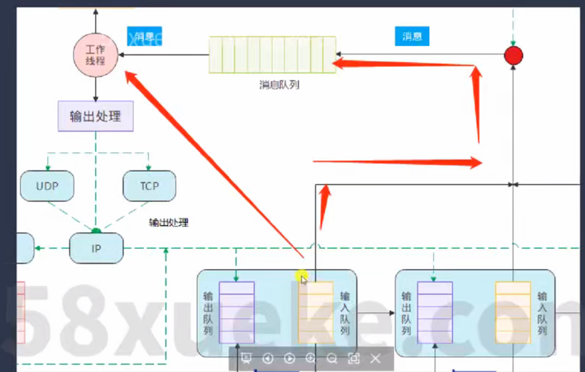
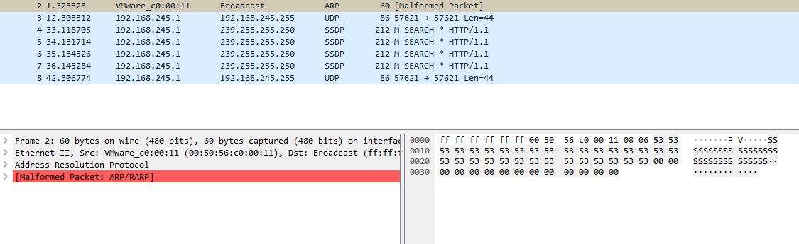

# TCP/IP 协议栈

本仓库是一个教学与实验用的轻量级 TCP/IP 协议栈实现示例（Windows/跨平台部分抽象）。主要目标是展示从链路层到网络层的实现思路、提供以太网接口（基于 Npcap/PCAP）用于发送/接收数据包，并包含若干示例应用（如 TCP 回显客户端/服务端）。

下面文档基于当前仓库的目录结构与源文件撰写，旨在帮助阅读代码、编译与调试这个项目，并说明链路层（以太网）实现的设计要点和可扩展方向。

## 快速导航

- 项目根：包含 `CMakeLists.txt`、Visual Studio 解决方案与工程文件（`tcpip.sln`, `tcpip.vcxproj` 等）以及本 `README.md`。
- build/: CMake 生成的构建输出与 Visual Studio 解决方案（调试/发布构建目录）。
- docs/: 项目相关图片与文档资源（例如系统框架图、帧格式图）。
- npcap/: 捆绑的 Npcap/WinPcap 头文件与静态库（供本工程在 Windows 下编译并链接 pcap 功能）。
- src/: 源码目录，包含 `app/`（示例应用）、`net/`（协议栈核心）与 `plat/`（平台/驱动适配）等子目录。
- work/: 演示或静态资源（如一个小型网页目录），与协议栈功能无关但作为演示/测试资源保留。

## 主要功能与目标

1. 在协议栈中增加/演示以太网链路层的支持，使上层 IP/TCP 可以通过真实网络接口发送/接收数据。
2. 提供一个 PCAP/NPcap 后端（`netif_pcap`），用于在用户空间发送/捕获以太网帧，便于在 Windows 环境下调试与学习。
3. 包含示例应用（echo client/server）展示如何使用协议栈的 socket/接口进行数据传输（示例位于 `src/app/echo`）。

## 环境依赖

- Windows（开发/测试环境）
- Visual Studio（推荐 2019/2022，任一支持 CMake 或 MSBuild 的版本）或等价的 C++ 编译链
- CMake（用于生成项目文件）
- Npcap（Windows 下的 Packet Capture 驱动库；可使用仓库内 `npcap/` 提供的头与 lib 链接，运行时仍需在系统中安装 Npcap 驱动）

注意：在 Windows 上捕包/注入以太网帧通常需要管理员权限或启用 Npcap 的非管理员访问选项。

## 目录说明（按重要性）

- build/
    - CMake 生成输出、Visual Studio 解决方案与中间文件。编译后可在该目录下找到 `net.exe`（例如 `build/Debug/net.exe`）。

- docs/
    - 项目图片与说明（例如系统框架图 `image.png`，帧格式示意图）。

- npcap/
    - Include/: Npcap/WinPcap 的头文件（`pcap.h`, `Packet32.h` 等）。
    - Lib/: 静态/导入库（x64/ARM64 等），用于链接 PCAP 抓包/注入功能。

- src/
    - app/
        - echo/: 示例应用：`tcp_echo_client.c`, `tcp_echo_server.c`，展示如何使用协议栈建立 TCP 连接并回显数据。
        - test/: 可能包含小型测试程序（`main.c`）用于启动/测试协议栈。

    - net/
        - net/: 协议栈核心头文件（`net.h`, `ipaddr.h`, `pktbuf.h`, `netif.h` 等），定义数据结构、错误类型与接口契约。
        - src/: 协议栈实现（`net.c`, `ipaddr.c`, `pktbuf.c`, `netif.c` 等），包括：
            - 报文缓冲（mblock/pktbuf）管理
            - 网络接口抽象（netif）与网络层/传输层基本逻辑
            - 调试输出（dbg.c）与内部消息机制（exmsg.c）

    - plat/
        - 平台/驱动适配层实现：
            - `net_plat.c` / `sys_plat.c`: 平台相关的初始化/时间/线程/同步原语封装
            - `netif_pcap.c`: 基于 PCAP/Npcap 的网络接口实现，负责实际发送/接收以太网帧

- work/
    - 演示/静态资源目录，不直接参与协议栈编译，但可能包含用于演示的网页与资源。

## 代码契约与主要模块说明（简短契约）

1. netif（网络接口抽象）
     - 输入：上层传入的 IP/ARP 等数据包（pktbuf/tcpip 报文结构）
     - 输出：通过特定链路（Ethernet/PCAP）发送原始以太网帧
     - 错误模式：返回 `net_err_t`（见 `net_err.h`）以表征失败原因

2. 链路层（link_layer）
     - 每种链路实现需提供 `open`, `close`, `send/out`, `receive/in` 等回调
     - 在 `netif_open` 中会根据 netif 类型选择合适的 link_layer（例如 PCAP）并调用其 `open` 以开始 I/O

3. PCAP 后端（`netif_pcap.c`）
     - 负责打开 Npcap 会话、捕获以太网帧并把帧交给上层解析
     - 发送时将上层 IP 数据封装为以太网帧并通过 pcap_sendpacket 等 API 注入到网卡

## 链路层（以太网）设计细节与实现提示

链路层是 OSI 第二层的实现要点，这里强调工程内的设计思路：

- 使用链路层实现数组或注册表（register_layer）来管理不同类型接口（例如 LOOPBACK、PCAP、其他驱动）。每个实现都提供统一的回调集合：open/close/in/out 等。
- netif 结构会保存一个指向当前链路层实现的指针（例如 netif->link_layer），在 `netif_open` 时通过 `netif_get_layer(netif->type)` 绑定具体实现。
- 发送流程（简化）:
    1. 上层（IP/TCP）生成 pktbuf
    2. 调用 netif->link_layer->out(netif, pktbuf) 将其封装为以太网帧
    3. 链路实现调用平台/驱动接口（如 pcap_sendpacket）将帧注入到物理网卡

- 接收流程（简化）:
    1. 链路后端（pcap）捕获到以太网帧
    2. 将帧解析出以太网头，并将有效载荷转换为 pktbuf
    3. 调用上层处理回调（如 netif_input）把 IP 数据包交给 IP 层处理

实现注意事项与边界条件：

- 必须处理 MTU 与分片（若上层有相关实现）
- 对于捕获与发送的并发访问要做好线程同步（platform 层提供锁/信号量）
- 捕获过滤器（BPF）可用于减少不必要的数据包处理（在 netif_pcap 中设置 filter）

### 11. 实现目标

1. 在协议栈增加对以太网协议的支持
2. 支持通过以太网接口收发数据包

### 11 链路层（补充说明）

链路层也叫数据链路层（OSI 第 2 层），负责在直接相连的两个网络实体之间传送数据帧。它将上层（如 IP）生成的包封装到链路帧（例如以太网帧）中发送，同时从物理设备接收帧并将有效载荷交给上层协议处理。

主要职责：
1. 帧封装/解封装（frame encapsulation/decapsulation）
2. 设备地址（MAC）处理与存储
3. 错误检测（例如以太网的 FCS，若实现的话）
4. 支持多种链路类型（Ethernet、Loopback、PPP、TUN/TAP、PCAP/虚拟接口等）
5. 将底层硬件/驱动抽象为一致的接口，供上层（netif, IP）调用发送/接收操作

#### 11 添加以太网接口实现细节

1. 定义一个链路层 `link_layer` 指针数组，里面每一项都指向特定的链路层协议的处理函数集合（例如 open, close, in, out）。使用回调函数可以避免大量的 if-else 分支，通过 `register_layer` 根据不同的链路层注册相应的接口函数。
2. 在 `netif_open` 中会调用 `err = ops->open(netif, ops_data);` 来识别并打开当前网络类型（例如以太网）。通常会执行类似 `netif->link_layer = netif_get_layer(netif->type);` 的绑定操作以根据类型获取其链路层实现。
3. 当网络接口需要发送数据包时，先确保链路层已打开：例如

```
net_err_t err = netif->link_layer->open(netif);
// 然后通过 link_layer 的 out/send 回调发送 pktbuf
```

将以上实现要点添加到链路层设计段的适当位置，可帮助读者快速将教学目标与工程实现对应起来。

## 构建与运行（Windows / cmd）

以下示例使用 Windows 的 cmd.exe。根据本机的 Visual Studio 与 CMake 版本，生成器名称可能不同（例如 Visual Studio 16 2019 / 17 2022）。

1) 使用 out-of-source CMake 构建（推荐）

```cmd
cd \path\to\project\root
mkdir build
cd build
cmake ..
cmake --build . --config Debug
```

说明：
- `cmake ..` 将自动选择本机默认生成器，或使用 `-G` 指定生成器（例如 `-G "Visual Studio 17 2022"`）。
- 编译后可在 `build\Debug\` 或 `build\Release\` 下找到 `net.exe` 等可执行文件。

2) 直接打开 Visual Studio

- 在项目根或 `build` 目录打开 `tcpip.sln` 或 `net.sln`，选择配置（Debug/Release），然后编译并运行。

3) 运行程序（示例）

```cmd
cd build\Debug
net.exe
```

注意：若使用 PCAP/NPcap 功能，请以管理员身份运行可执行文件以保证抓包与注入权限，或安装 Npcap 时启用非管理员访问选项。

## 链接与库设置（Npcap）

工程已将 `npcap/Include` 和 `npcap/Lib` 中的头与库组织在仓库内，用于在 Visual Studio 中配置附加包含目录与库目录：

- 包含目录（Include）：`npcap\Include`（包含 `pcap.h` 等）
- 库目录（Lib）：`npcap\Lib\x64` 或 `npcap\Lib` 下对应平台的目录（将 `wpcap.lib` / `Packet.lib` 添加到链接项）

运行时仍需在系统上安装 Npcap 驱动（https://nmap.org/npcap/），否则网卡捕获与注入功能不可用。

## 调试建议

- 使用 Visual Studio 的调试器（断点、调用栈、内存检查）是调试本工程的主要方式。
- 若怀疑数据包未正确发送/捕获：
    - 确认以管理员权限运行
    - 使用 Wireshark/WinPcap/Npcap 的本地界面查看实际网卡上的流量
    - 在 `netif_pcap.c` 中添加详细日志（或使用现有的 `dbg.c` / `dbg.h` 打印宏）观察 open/send/recv 流程
- 常见问题：链接找不到 `wpcap.lib`/`Packet.lib`（请确认 `npcap/Lib/x64` 已加入库目录且目标平台匹配 x64/x86）

## 常见问题与解决办法

- 无法捕获数据包/注入失败：
    - 确认 Npcap 已安装并允许非管理员访问（或以管理员身份运行程序）
    - 如果使用虚拟机/容器，检查宿主网卡是否允许混杂模式

- 编译器/生成器错误：
    - 若 CMake 选择的生成器与本机 Visual Studio 版本不符，可显式指定 `-G` 参数

- 运行时找不到 DLL：
    - 若使用动态链接的第三方库，确保相应的 DLL 在 PATH 中或可执行目录下

# 框架图



# 11.以太网协议
1.主要内容：发送上层来的ip数据包到相邻计算机，接收数据包提取ip数据包到上传到上层
2.以太帧有很多类型，EthernetⅡ帧是最常见的帧类型


# 11.成功给网卡发送数据包
以太网数据包发送流程如下：

1. **数据包分装**
    - 上层协议（如IP/TCP）生成待发送的数据，首先分配缓冲区（pktbuf），并填充数据内容。
    - 调用链路层接口，将数据包分装为以太网帧：
      - 设置目的MAC地址（如目标主机或广播地址）、源MAC地址（本机网卡MAC）、协议类型（如IPv4/ARP）。
      - 以太网帧格式：`[目的MAC][源MAC][类型][数据][填充]`
    - 代码实现中，通常用 `plat_memcpy` 拷贝MAC地址，用 `x_htons` 设置协议类型。

2. **判断网卡类型并分别处理**
    - 如果目标MAC地址与本机MAC地址相同，说明是回环网卡（Loopback），数据包直接送入输入队列（netif_put_in），协议栈内部处理，无需实际发送到物理网卡。
    - 如果目标MAC地址与本机MAC地址不同，说明是普通网卡：
      - 数据包先进入输出队列（netif_put_out），用于异步发送或排队。
      - 由底层驱动（如PCAP/Npcap）调用实际发送函数（如 `pcap_sendpacket`），将数据包注入到物理网卡。
      - 发送前会自动补齐以太网最小帧长（64字节），不足时填充0。

3. **抓包验证与调试输出**
    - 发送成功后，可用Wireshark等工具抓包，验证数据包内容、MAC地址、协议类型等。
    - 协议栈会打印调试信息，显示帧内容和处理流程，便于定位问题。

**流程图示意：**
1. 上层协议生成数据包 →
2. 分装为以太网帧 →
3. 判断网卡类型：
    - 回环网卡：直接送入输入队列
    - 普通网卡：进入输出队列，驱动层发送到物理网卡
4. Wireshark抓包验证




