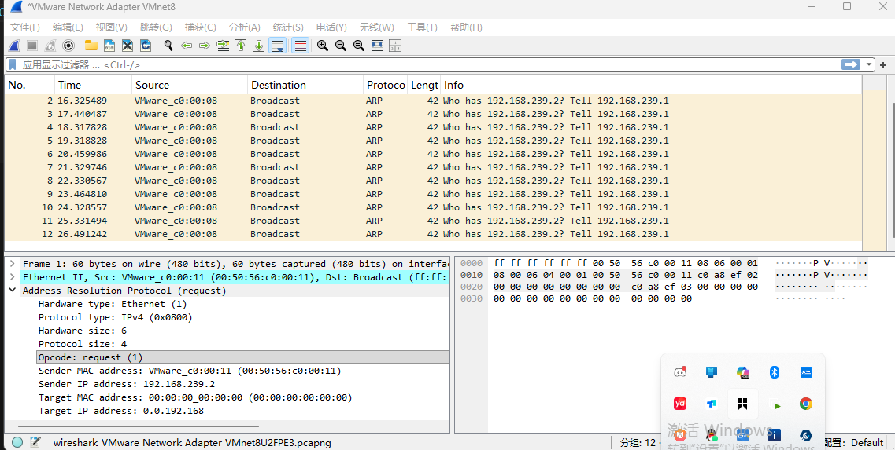
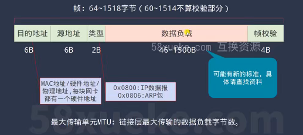

# 框架图

# 11.以太网协议
1.主要内容：发送上层来的ip数据包到相邻计算机，接收数据包提取ip数据包到上传到上层
2.以太帧有很多类型，EthernetⅡ帧是最常见的帧类型

# 11.实现目标
    1.在协议栈增加对以太网协议的支持
    2.支持通过以太网接口收发数据包

## 11 添加以太网接口实现细节
1.定义一个链路层link_layer指针数组,里面每一项都指向特定的链路层协议的处理，比如open,close,in,out,使用回调函数就不用给if-else去判断了，通过register_layer根据不同的链路层注册相应的接口函数
2.在netif_open里面有 err = ops->open(netif, ops_data); 识别当前的网络类型是什么（以太网，网络接口）， netif->link_layer = netif_get_layer(netif->type); // 根据类型获取其链路层
3.如果要网络接口发送数据包，在 net_err_t err = netif->link_layer->open(netif);打开链路层进行输入输出的处理
